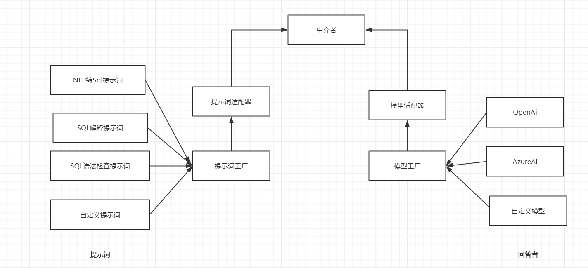
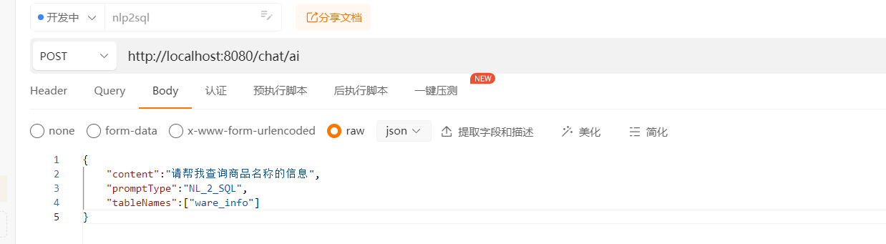

# Ai自动生成Sql

## 介绍

`ai-generater-sql`是一款基于AI来生成的生成各种语言Sql的工具.

但又不仅仅局限于自动生成Sql,还支持了校验Sql正确性以及解释Sql含义的功能。

## 设计目标

对Sql语句不熟悉，感觉写Sql比较繁琐的人提供一个自动帮助写Sql的小工具

## 功能特性

### Sql生成能力

- 通用Sql语句生成
- 自定义Sql语言生成

### sql验证能力：

- 校验Sql语法是否正确

### Sql解释

- 解释Sql本身的含义

### 知识问答能力

- 文本生成

### 多模型

- 可以自由切换模型【不局限于OpenAi】

## 设计架构


### 快速启动

将项目导入到Idea中后配置自己的模型所需的参数以及要从哪个数据库中生成sql的连接信息

```yaml
chat:
  ai:
    azureAi:
      open-key: xxx
      endpoint: https://evtech.openai.azure.com
      name-space: xxx
      model: gpt3.5
db:
  driver-class-name: com.mysql.cj.jdbc.Driver
  url: jdbc:mysql://localhost:3306/test?serverTimezone=Asia/Shanghai
  username: root
  password: root
  db-type: mysql
```


启动成功打开apipost进行访问,

输入内容最终生成指定表的sql语句




### 帮助
github地址: https://github.com/Lifu12/lufei-auto-generate-sql <br>
gitee地址:https://gitee.com/kun_gege/lufei-auto-generate-sql <br>
后续如果有不懂的地方,请关注公众号`编程思维阁` 进行交流
或者添加作者微信进交流群<br>

